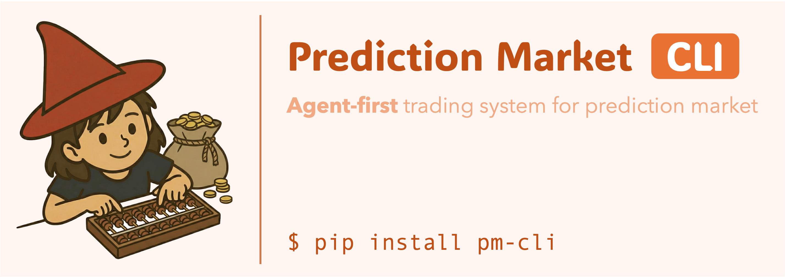
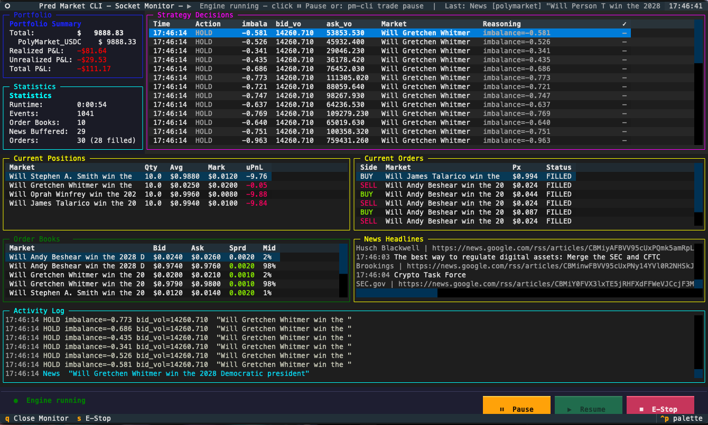

<h1 align="center">
  Agent-First Trading System for Prediction Markets
</h1>

<p align="center">
  <a href="https://www.python.org/downloads/"></a>
  <a href="https://pypi.org/project/coinjure/"></a>
  <a href="https://github.com/ulab-uiuc/prediction-market-cli/blob/main/LICENSE"></a>
</p>

Coinjure is an agent-first trading stack for prediction markets.

The goal is simple: give an autonomous agent everything it needs to design, test, and run strategies end-to-end, while the human operator only does two things:

1. Monitor the system.
2. Pause or emergency-stop when needed.

## 1-Minute Start

```bash
coinjure paper run --exchange polymarket --strategy-ref coinjure.strategy.orderbook_imbalance_strategy:OrderBookImbalanceStrategy

coinjure monitor
```



## Why Agent-First

AI agents are now strong enough to self-discover alpha from messy, fast-moving market and news streams. The practical question is no longer “can an agent reason about trades,” but:

Can we build the tools, infrastructure, and environment that let an agent operate like a disciplined human trader, but through command-line APIs that are easy for agents to use?

Coinjure is our answer:

- Strategy is the primary interface.
- The engine owns execution, risk checks, and lifecycle.
- Data, simulation, monitoring, and live controls are unified behind CLI commands.

This lets agents iterate quickly, safely, and reproducibly without rebuilding trading plumbing for every strategy or exchange.

## What We Provide for Agent Trading

Coinjure provides the full toolchain needed by an autonomous trading agent:

- Unified strategy API across Polymarket and Kalshi.
- Live market + news ingestion in paper mode.
- Built-in paper trading execution engine.
- Backtest replay for regression checks.
- Runtime monitor and control socket.
- Pause/resume/stop controls for human override.

In paper mode, `--exchange polymarket` and `--exchange kalshi` run with a composite source (market feed + Google News + RSS), with conservative news polling defaults.

## System Structure

Core runtime components:

- `DataSource`: live market/news or historical replay.
- `Strategy`: async decision logic (`process_event`).
- `Trader`: execution adapter (`PaperTrader`, `PolymarketTrader`, `KalshiTrader`).
- `RiskManager`: pre-trade constraints and safety checks.
- `PositionManager`: positions, realized/unrealized PnL.
- `TradingEngine`: event loop, orchestration, monitoring state.
- `ControlServer`: pause/resume/status/stop via Unix socket.
- `Monitor UI`: human visibility and emergency controls.

```text
TradingEngine
  |- DataSource (market/news/backtest)
  |- Strategy (agent logic)
  |- Trader (paper/live exchange adapter)
  |  |- RiskManager
  |  |- PositionManager
  |- ControlServer (socket)
  |- Monitor UI (operator)
```

## Installation

```bash
pip install coinjure
```

From source:

```bash
git clone https://github.com/ulab-uiuc/prediction-market-cli.git
cd prediction-market-cli
pip install poetry
poetry install
```

## Quick Start (CLI Only)

### 1) Explore market and news inputs

```bash
coinjure market list --exchange polymarket --limit 20
coinjure market search --exchange polymarket --query "election" --limit 20
coinjure market info --exchange polymarket --market-id <market_id>

coinjure news fetch --source google --query "prediction market" --limit 10
coinjure news fetch --source rss --query "fed rates" --limit 10
```

### 2) Scaffold and validate a strategy

```bash
coinjure strategy create --output ./strategies/my_strategy.py --class-name MyStrategy
coinjure strategy validate --strategy-ref ./strategies/my_strategy.py:MyStrategy
```

Use constructor kwargs when needed:

```bash
coinjure strategy validate \
  --strategy-ref ./strategies/my_strategy.py:MyStrategy \
  --strategy-kwargs-json '{"trade_size": "25", "entry_imbalance": 0.35}'
```

Quick runtime smoke check before backtest/paper run:

```bash
coinjure strategy dry-run \
  --strategy-ref ./strategies/my_strategy.py:MyStrategy \
  --strategy-kwargs-json '{"trade_size": "25"}' \
  --events 10 --json
```

Built-in example strategy files (good templates for agents):

```bash
coinjure strategy validate \
  --strategy-ref ./examples/strategies/threshold_momentum_strategy.py:ThresholdMomentumStrategy

coinjure strategy validate \
  --strategy-ref ./examples/strategies/orderbook_pressure_strategy.py:OrderBookPressureStrategy
```

### 3) Run paper trading with monitor

```bash
coinjure paper run \
  --exchange polymarket \
  --strategy-ref ./strategies/my_strategy.py:MyStrategy \
  --strategy-kwargs-json '{"trade_size": "25"}' \
  --monitor
```

### 4) Operator control commands (separate terminal)

```bash
coinjure trade status
coinjure trade pause
coinjure trade resume
coinjure trade stop
```

### 5) Record and backtest

```bash
coinjure data record --exchange polymarket --output ./data/events.jsonl --duration 300

# Standard backtest (interactive output)
coinjure backtest run \
  --history-file ./data/events.jsonl \
  --market-id M1 \
  --event-id E1 \
  --strategy-ref ./strategies/my_strategy.py:MyStrategy

# Machine-readable JSON output (agent-friendly)
coinjure backtest run \
  --history-file ./data/events.jsonl \
  --market-id M1 --event-id E1 \
  --strategy-ref ./strategies/my_strategy.py:MyStrategy \
  --json
# → {"ok": true, "total_trades": 12, "win_rate": "0.583", "sharpe_ratio": "1.24", ...}
```

### 6) Agent strategy-discovery toolkit (`research`)

Use these composable tools when an agent needs to discover strategies on yes/no time-series:

```bash
# 1) build a clean per-market slice
coinjure research slice \
  --history-file ./data/events.jsonl \
  --market-id M1 --event-id E1 \
  --output ./data/m1_e1_slice.jsonl

# 2) build features + labels
coinjure research features \
  --history-file ./data/events.jsonl \
  --market-id M1 --event-id E1 \
  --output ./data/m1_e1_features.jsonl

coinjure research labels \
  --history-file ./data/events.jsonl \
  --market-id M1 --event-id E1 \
  --horizon-steps 5 \
  --threshold 0.01 \
  --output ./data/m1_e1_labels.jsonl

# 3) run parameter sweeps, rank, and persist memory
coinjure research backtest-batch \
  --history-file ./data/events.jsonl \
  --market-id M1 --event-id E1 \
  --strategy-ref ./strategies/my_strategy.py:MyStrategy \
  --params-jsonl ./data/params.jsonl \
  --output ./data/batch_runs.jsonl

coinjure research compare-runs \
  --input-file ./data/batch_runs.jsonl \
  --sort-key sharpe_ratio \
  --top 20 \
  --output ./data/top_runs.jsonl

coinjure research memory add \
  --input-file ./data/top_runs.jsonl \
  --tag m1_e1

# 4) multi-market sweep — test one strategy across N markets at once
coinjure research batch-markets \
  --history-file ./data/events.jsonl \
  --strategy-ref ./strategies/my_strategy.py:MyStrategy \
  --limit 50 \
  --output ./data/batch_markets.jsonl \
  --json
# → {"ok_markets": 42, "total_markets": 50,
#    "aggregate": {"mean_sharpe": "0.82", "pct_profitable": "68.0", ...}}

# 5) hyperparameter grid search on one market
coinjure research grid \
  --history-file ./data/events.jsonl \
  --market-id M1 --event-id E1 \
  --strategy-ref ./strategies/my_strategy.py:MyStrategy \
  --param-grid-json '{"threshold": [0.01, 0.02, 0.05], "trade_size": [25, 50, 100]}' \
  --output ./data/grid_results.jsonl \
  --json
# → {"runs": 9, "ok_runs": 9, "best": {"threshold": 0.02, "trade_size": 50, "sharpe_ratio": "1.31", ...}}
```

Also available: `research walk-forward`, `research stress-test`, `research strategy-gate`, and `research memory list`.

### 7) Live price history (`market history`)

Fetch a market's recent price history from the Polymarket CLOB API — no local data file needed:

```bash
coinjure market history --market-id 516926 --interval 1d --limit 30 --json
# → {"market_id": "516926", "points": 30,
#    "series": [{"t": 1772096447, "p": 0.42}, ...],
#    "first_price": 0.42, "last_price": 0.71, "total_move": 0.29}
```

Supported intervals: `1d` (default), `6h`, `1h`.

## Human-in-the-Loop Model

The operator is intentionally lightweight:

- Use `coinjure monitor` for live visibility.
- Use `coinjure trade pause|resume|stop` for intervention.

The operator should not need to manually place/cancel orders in normal operation.

## CLI Reference

Primary command groups:

- `coinjure strategy`: create and validate strategies.
- `coinjure paper`: paper trading with live feeds.
- `coinjure backtest`: historical replay.
- `coinjure monitor`: attach monitor UI to running engine.
- `coinjure trade`: runtime control (`status`, `pause`, `resume`, `stop`, `killswitch`).
- `coinjure market`: market discovery and metadata.
- `coinjure news`: standalone news fetching.
- `coinjure data`: live event recording.
- `coinjure research`: strategy-discovery tools (slice/features/labels/backtest-batch/batch-markets/grid/walk-forward/stress-test/strategy-gate/memory).
- `coinjure market history`: live price history from Polymarket CLOB API.

## Environment Variables

```bash
export POLYMARKET_PRIVATE_KEY="your_private_key"
export KALSHI_API_KEY_ID="your_kalshi_key_id"
export KALSHI_PRIVATE_KEY_PATH="/path/key.pem"
```

## Development

```bash
poetry install --with dev,test
pre-commit install
ruff check . && ruff format .
mypy coinjure/
pytest tests/ -v
```

## License

[MIT](https://github.com/ulab-uiuc/prediction-market-cli/blob/main/LICENSE)

## Disclaimer

This software is for educational and research use. Live trading carries financial risk.
